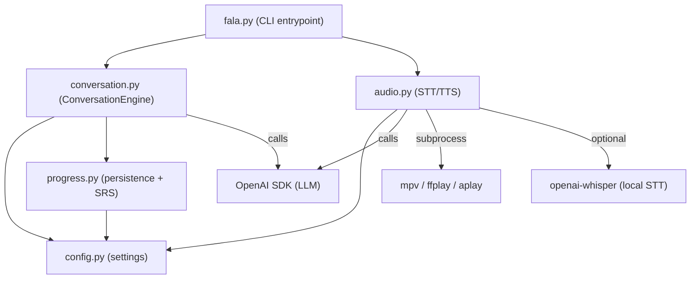

# FALA Architecture

## Overview

FALA is a CLI-based conversational European Portuguese tutor. It uses a large language model (LLM) to drive tutoring conversation, spaced repetition for vocabulary review, and optional speech-to-text / text-to-speech for spoken interaction.

**Target proficiency**: A1 → B1 (CEFR).

## Module dependency graph



**Dependency direction**: `fala.py → conversation.py → progress.py` and `fala.py → audio.py`. `config.py` is a leaf module read by all others.

## Data flow — typical session

```
┌──────────┐     ┌──────────────────┐     ┌────────────┐     ┌──────────┐
│  fala.py │────▶│ ConversationEng. │────▶│ progress.py│────▶│   Disk   │
│  (main)  │     │  (orchestrator)  │     │  (SRS/etc) │     │  (files) │
└──────────┘     └──────────────────┘     └────────────┘     └──────────┘
     │                   │                      │                 │
     │                   │                      │  read/write     │
     │                   │                      │  summary.md     │
     │  user input       │  LLM call (OpenAI)   │  vocabulary.md  │
     │  (text/voice)     │  prompt templates    │  sessions/      │
     └──────────────────┘──────────────────────┘                 │
                            │                                    │
                            ▼                                    ▼
                     OpenAI SDK (gpt-4o)               data/sessions/YYYY-MM-DD-HHMM.md
```

### Session lifecycle

1. **Startup** (`main()`)
   - `ConversationEngine.__init__()` loads `summary` and `vocabulary` from disk
   - Builds system prompt from `prompts/system.md`, interpolating `{level}`, `{summary}`, `{vocabulary}`
   - Prints CLI banner via Rich

2. **Status report** (`get_status_report()`)
   - Parses current level and session count from `summary.md`
   - Queries `get_review_words()` for due vocab count
   - Returns: `"Level: A1 | Sessions: 3 | Words due for review: 5 | Session started: ..."`

3. **Warm-up** (`start_warmup()`)
   - Loads `prompts/warmup.md`, interpolates `{summary}` and `{vocabulary}`
   - Appends as a `user` message to the conversation
   - Calls LLM, logs the response
   - Returns tutor text → displayed in a Rich `Panel`

4. **Conversation loop** (`while True`)
   - Optionally records audio and transcribes (if voice mode)
   - Sends user text to `user_message()`
   - `user_message()` appends to messages array → calls LLM → extracts any new vocabulary via a secondary LLM call → returns tutor text

5. **End session** (`end_session()`)
   - Persists vocabulary to `vocabulary.md`
   - Saves raw session log to `data/sessions/YYYY-MM-DD-HHMM.md`
   - Calls LLM to produce an updated progress summary → writes to `summary.md`
   - Returns summary string

## SRS (Spaced Repetition System)

FALA uses a simplified **SM-2** algorithm, assessed through LLM confidence rather than explicit user ratings.

### Vocabulary entry schema

Each word in `vocabulary.md`:

```yaml
- word: "obrigado"
  english: "thank you"
  context: "Obrigado pela ajuda."
  ease: 2.5          # multiplier for interval (SM-2 ease factor)
  interval: 1        # days until next review
  last_reviewed: "2026-06-24"
  confidence: 0.5    # 0.0–1.0, LLM-assessed
  needs_review: true # force review regardless of interval
```

### Algorithm (`update_vocab_after_review()`)

When a word is reviewed:

| Condition | Confidence Δ | Ease Δ | Interval |
|-----------|-------------|--------|----------|
| **Correct** | `+0.15` (cap 1.0) | `+0.1` (floor 1.3) | `interval × ease` |
| **Incorrect** | `-0.2` (floor 0.0) | `-0.2` (floor 1.3) | reset to 1 |

A word is **due for review** when:
- `current_date >= last_review + interval` **OR** `needs_review == true`

Words with `confidence >= 0.8` have `needs_review` set to `false`.

### Important: SRS feedback loop is disconnected

The function `update_vocab_after_review()` exists in `progress.py` but is **never imported or called** by `conversation.py`. The conversation module only imports:
- `add_vocabulary` (adds new words with confidence=0.3)
- `get_review_words` (queries due words)
- `get_vocab_for_prompt` (formats vocab for prompt)
- `load_summary`, `save_summary`, `load_vocabulary`, `save_vocabulary`

This means:
- New words are added with `confidence=0.3` and `needs_review=True`
- They will always be due (because `needs_review=True`) until confidence crosses 0.8
- But confidence is **never incremented** through the warm-up review process
- The SRS is essentially write-only — words accumulate but never graduate

Similarly, `save_learning_record()` is never called.

## Prompt template structure

### `prompts/system.md` (tutor personality)

```
You are a warm, patient European Portuguese tutor...
## Your Role — pt-PT only, level-adapted scaffolding
## Conversation Style — short, natural, bilingual
## Error Correction — critical immediate, minor end-of-turn
## Modality Suggestions — "Try saying this out loud!"
## Pronunciation Feedback — specific pt-PT sounds
## Session Flow — status → warmup → conversation → end
## What NOT to do — no Brazilian PT, no Duolingo style
## Learner Context — {summary}
## Vocabulary Due for Review — {vocabulary}
```

**Template variables**: `{level}`, `{summary}`, `{vocabulary}`

### `prompts/warmup.md` (warm-up phase)

```
You are starting the warm-up phase...
## Learner Profile — {summary}
## Vocabulary Due — {vocabulary}
## Instructions — greet, review 3-5 words, introduce up to 5 new, grammar point
## Rules — keep moving, be encouraging, transition to free conversation
```

**Template variables**: `{summary}`, `{vocabulary}`

### Dynamic prompts (injected at runtime)

- **Vocabulary extraction prompt** (hardcoded in `_extract_vocab_from_exchange()`): instructs the LLM to return a JSON array of new Portuguese words from the exchange.
- **Summary update prompt** (hardcoded in `end_session()`): instructs the LLM to produce an updated progress summary from the current summary + session transcript.

## Audio pipeline

### TTS (Text-to-Speech) — `speak(text)`

```
text_to_speech(text)
  │
  ├─ OpenAI TTS (tts-1) ─────► temp .mp3 file
  │
  └─► play_audio(path)
       │
       ├─ mpv (preferred)
       ├─ ffplay (fallback)
       └─ aplay (last resort)
```

If all players fail, returns `False` silently. The caller (`fala.py`) calls `print_tutor(response, speak_audio=True)` regardless — audio failure is invisible.

### STT (Speech-to-Text) — `listen()`

```
listen()
  │
  └─► record_audio(duration=10)
  │    │
  │    ├─ arecord (Linux, preferred)
  │    └─ rec (SoX, fallback)
  │
  └─► speech_to_text(path)
       │
       ├─ openai-whisper (local, if installed) ───► return text
       │
       └─ OpenAI Whisper API (cloud) ──────────────► return text
```

Local Whisper is attempted first (via `import whisper`). If not installed, falls through to the OpenAI Whisper API (`whisper-1` model). Both use `language="pt"`.

## Key design decisions

| Decision | Rationale |
|----------|-----------|
| **CLI over web/mobile** | Low friction, fast iteration, works in any terminal. The target user is developers / early adopters comfortable with a terminal. |
| **Single LLM for everything** | One model handles tutoring, error correction, pronunciation feedback, vocabulary extraction, and summary updates. Simpler architecture than multi-agent, but couples all quality to one model. |
| **File-based markdown persistence** | Human-readable, grep-friendly, version-controllable. No database dependency. Markdown is easy for LLMs to parse and generate. |
| **LLM-assessed SRS confidence** | Instead of asking the user to rate themselves (1–4), the LLM assesses confidence from the conversation. This is seamless but makes the SRS quality dependent on the LLM's judgement accuracy. |
| **Hybrid audio — local STT + cloud TTS** | Local Whisper avoids API latency for speech recognition. Cloud TTS gives natural pt-PT voices (local EP TTS voices are scarce). Both fall back gracefully. |
| **Priority-based error correction** | Meaning-breaking errors are corrected immediately; minor grammar notes are deferred to end of turn. Mirrors how a human tutor works. |
| **European Portuguese only** | No Brazilian vocabulary or pronunciation compromises. Keeps the prompt simple and the tutor consistent. |
| **OpenAI API-compatible** | `FALA_BASE_URL` allows any OpenAI-compatible provider. Not locked to OpenAI's servers, but the SDK and prompt format assume chat-completion API. |

## Latent issues and edge cases

### SRS not writing confidence updates (medium impact)
`update_vocab_after_review()` and `save_learning_record()` are defined in `progress.py` but never called. New words are added with `confidence=0.3` and remain at that level forever. The `get_review_words()` query uses `needs_review=True` as an eligibility signal, so words stay "due" indefinitely — the spaced repetition graduation path is broken.

### Vocabulary parser fragility (low impact)
`load_vocabulary()` splits on `"\n- word: "` which assumes the first entry's `- word:` is at the start of a line. If the file has unexpected leading text, the first entry may be dropped. The `_parse_vocab_entry` has a workaround for blocks starting with `"`, but the approach is fragile.

### Empty API key crashes (UX issue)
`config.py` resolves `LLM_API_KEY = os.getenv("FALA_API_KEY") or os.getenv("OPENAI_API_KEY", "")`. An empty string reaches the OpenAI SDK constructor, which raises `OpenAIError` before the CLI banner is displayed. The user must set the key before running — there's no graceful "set your API key" error path.

### Format-string injection risk in prompts (low severity)
Vocabulary and summary text is interpolated into prompt templates via `.format()`. If a word or summary contains `{` or `}` characters, it will cause a `KeyError`. Real-world risk is negligible (Portuguese words don't contain braces), but could surface if a user types `{}` in conversation.

### Silent audio failure (low impact)
If no audio player is installed (`mpv`, `ffplay`, `aplay`), `play_audio()` returns `False` and `speak()` returns `False`. The caller in `fala.py` ignores the return value, so audio silently fails. The user sees the tutor text but hears nothing.

### Unbounded session log growth (low impact)
Session logs are saved to `sessions/YYYY-MM-DD-HHMM.md` with no retention policy or pruning. Over many sessions, the directory accumulates files.

### Timezone-naive date comparisons (low impact)
SRS uses `datetime.now().strftime("%Y-%m-%d")` for date comparisons — no timezone awareness. Works correctly for single-user in a single timezone.

## README accuracy check

| README claim | Code status | Notes |
|-------------|-------------|-------|
| "LLM-powered tutoring" | ✅ | `_call_llm()` in conversation.py |
| "European Portuguese only" | ✅ | `prompts/system.md` line 4 |
| "Voice input/output" | ✅ | `audio.py` — TTS + STT |
| "Priority-based error correction" | ✅ | System prompt instructions (critical vs minor) |
| "Pronunciation feedback" | ✅ | System prompt section, relies on LLM |
| "Persistent memory" | ✅ | `summary.md`, `vocabulary.md` |
| "Spaced repetition" | ⚠️ Partial | SM-2 scheduler exists but `update_vocab_after_review` is never called |
| "/voice toggle" | ✅ | `fala.py` line 71 |
| "File-based markdown" | ✅ | All persistence via `progress.py` |
| "SM-2-style scheduler" | ⚠️ Partial | Algorithm implemented but graduation path disconnected |
